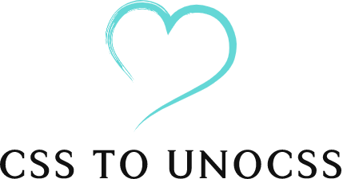

<p align="center">

</p>
<p align="center"> English | <a href="./README_zh.md">简体中文</a></p>


## Config
```
// Custom configuration highlighting style
// settings.json
  "to-unocss":{
    "dark": {
      "textDecoration": "underline",
      "backgroundColor": "rgba(144, 238, 144, 0.5)",
      "color": "black",
    },
    "light":{
      "textDecoration": "underline",
      "backgroundColor": "rgba(255, 165, 0, 0.5)",
      "color": "#ffffff",
    }
  }
```

## :coffee:

[buy me a cup of coffee](https://github.com/Simon-He95/sponsor)

## License

[MIT](./license)
